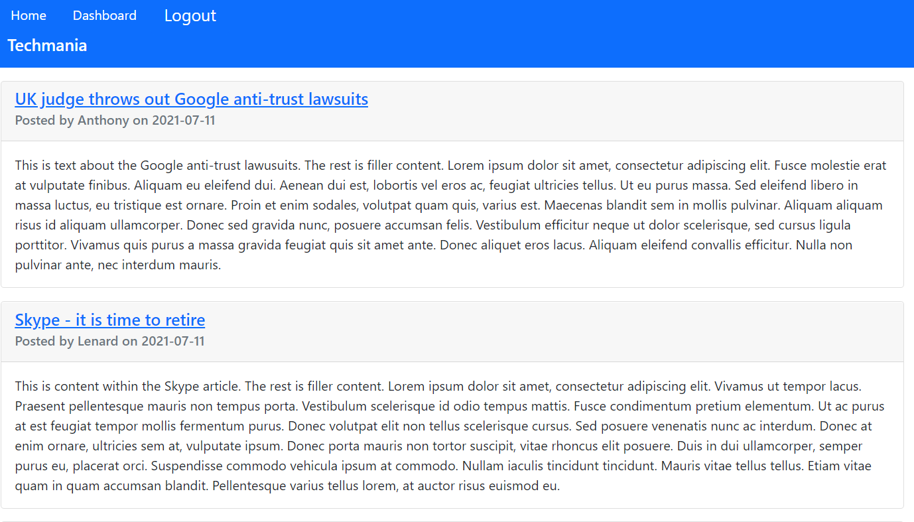

# Homework Assignment - 14 Model-View-Controller (MVC): Tech Blog

## Table of Contents
[Description](#description)

[Key Features](#key-features)

[Technology Used](#technology-used)

[License](#license)

[Links](#links)

[Screenshots](#screenshots)

## Description
The focus of this homework assignment for the University of Toronto SCS Coding Boot Camp was to build a CMS-style blog site similar to a Wordpress site, where developers can publish their blog posts and comment on other developers’ posts as well. No starter code was provided with this homework assignment.

## Key Features
- The application follows the MVC paradigm in its architectural structure, using Handlebars.js as the templating language, Sequelize as the ORM, and the express-session npm package for authentication.
- Navigation bar links are displayed based on the user being logged in or not.
- Users can sign-up and if they signed up previously they can log in with their email address and password which is hashed by the npm package bcrypt
- The home page presents all blog posts from the database including their title, content, author and data created
- If the user clicks on a post on the homepage that they have written they are directed to a page where they can view the post along with its comments, and update or delete the post if they wish
- If the user clicks on a blog post they did not write they are directed to a page where they can view the post along with its comments, and add a comment of their own
- The dashboard presents titles of blog posts that have been written by the logged in user specifically that they can then select, or they can add a new blog post
- Users are logged out when session expires or when they select logout from the navigation bar

## Technology Used
- HTML, CSS including Bootstrap, JavaScript
- MySQL
- Heroku
- NPM packages: bcrypt, connect-session-sequelize, dotenv, express, express-handlebars, express-session, mysql2, sequelize

## License
This product is under the MIT License.

## Links
- [GitHub repository](https://github.com/darylnauman/tech-blog)
- [Deployed application on Heroku]()

## Screenshots
The images below show the application.

